# Chest X-Ray Pneumonia (Deep learning with TensorFlow)

Detect pneumonia from chest X-ray images using Tensorflow/Keras, FastAPI, Docker, and Kubernetes Kind.

## Problem & Dataset

The goal is to classify chest X-ray images as either **PNEUMONIA** or **NORMAL**. 

The Kaggle dataset `paultimothymooney/chest-xray-pneumonia` is organized into 3 folders (train, test, val) and contains subfolders for each image category. There are 5,863 X-Ray images (JPEG) and the 2 categories (Pneumonia/Normal). 

- You'll find the dataset at https://www.kaggle.com/datasets/paultimothymooney/chest-xray-pneumonia .

## Repo Layout

- `notebooks/`: EDA + training (see `notebook.ipynb`)
- `train.py`: training entrypoint (exports a Keras model)
- `service/predict.py`: FastAPI app (`GET /health`, `POST /predict`)
- `Dockerfile`: containerizes the service
- `k8s/`: Kubernetes manifests + Kind config (WSL2-friendly)

## Reproduce the project

- **Note:** The trained model file (the `.keras` artifact) is **not committed to GitHub** because it is large and ignored by `.gitignore` (`*.keras`). That means a fresh clone does **not** include the model weights. To run the service, you must first reproduce/download the model artifact (instructions below).

**The procedure follows this order:**
1. Train/download the model in Colab
2. Run the FastAPI service locally (uv)
3. Build the Docker image
4. Deploy to Kubernetes with Kind

## KaggleHub token (.env)

This project uses **KaggleHub** to download the dataset which requires a Kaggle token and adding it to your `.env` file. 
KaggleHub then downloads the dataset into your user cache (not into the repository). The repo scripts will find the `train/`, `val/`, and `test/` folders from that cache.

**1. Create your `.env` file at repo root:**
```bash
cp .env.example .env.local 
```    
- If you use a different env file name (for example `.env.dev`), specify the file name when running scripts that rely on environment variables with `python train.py --env-file .env.dev`.

**2. Create your Kaggle token from your Kaggle account settings:**
- Click 'Generate New Token' at https://www.kaggle.com/settings

**3. Paste your Kaggle token in the .env file's placeholder**
- `KAGGLE_API_TOKEN=your_kaggle_api_token_here`

## 1. Train in Colab and download the model artifact

The training procedure is documented directly inside `notebooks/notebook.ipynb`. Follow these steps:

**A. Open the notebook in Google Colab**
  - In Colab: `File → Open notebook → GitHub` and search for this repository, then open `notebooks/notebook.ipynb`
  - Alternatively, upload `notebooks/notebook.ipynb` from your local clone

**B. Run the notebook cells top-to-bottom**
  - The notebook uses `kagglehub.dataset_download('paultimothymooney/chest-xray-pneumonia')` to fetch the dataset
  - It will prompt you for your `KAGGLE_API_TOKEN` to paste in the input field (the token will automatically be loaded when running services below)

**C. At the end of the notebook, download the best model file from Colab**
  - In my case it is `resnet50v2_ft.keras` (the fine-tuned ResNet50V2 model)

## 2. Run the service locally (uv, no Docker)

This starts the FastAPI service locally and uses your model artifact.

You do not need the full Kaggle dataset to run inference. The API accepts any image you upload.
For convenience, this repo includes two sample images in `data/`.

**A. Start the web server:**
- Create an isolated Python environment, install the runtime dependencies (FastAPI, TensorFlow, Pillow, etc.), and start the web server on port `9696`:

```bash
uv venv --python 3.12 .venv
source .venv/bin/activate
uv pip install -r requirements.txt
python -m uvicorn service.predict:app --host 0.0.0.0 --port 9696
```

**B. Run an inference test:**
- Run the predict script on an image with curl:

```bash
curl http://127.0.0.1:9696/health
curl -X POST -F "file=@data/normal.jpeg" http://127.0.0.1:9696/predict
```

- **Expected output:**

  - `/health` returns `{"status":"ok"}`.
  - `/predict` returns a JSON payload containing scores for `pneumonia` and `normal`.

### Retrain the Model:

You can also retrain the model running the `train.py` script. This will overwrite the model artifact, but you’ll need:

- enough disk space for the dataset + training artifacts (the free tier Codespace storage capacity may not suffice)
- GPU for speedier training (this is why the repo uses Colab)

```bash
uv pip install -e ".[notebooks]"

python train.py --env-file .env.local \
  --dataset paultimothymooney/chest-xray-pneumonia \
  --output notebooks/artifacts/resnet50v2_ft.keras
```

What this does:
- The command `pip install -e ".[notebooks]"` is used to install the project in "editable mode" along with the dependencies specified under `Notebook/training dependencies` in the `pyproject.toml` file.
- `python train.py` downloads/locates the dataset via KaggleHub, trains a Keras model, and writes the model file to `notebooks/artifacts/resnet50v2_ft.keras` (the same path used by the API).

### Evaluate the Model (no retraining necessary):

- You can evaluate the model against the test set:

```bash
python scripts/eval_model.py --model notebooks/artifacts/resnet50v2_ft.keras
```

## 3. Build and test the Docker image (Containerization)

This builds the same FastAPI service into a Docker image and runs it as a container. The Docker image includes the trained model artifact.

**Note**: because `*.keras` files are ignored, the file must exist inside `notebooks/artifacts/` and be uncommented in `.dockerignore` **before** building the Docker image.

**A. Build and run the image:**

```bash
docker build -t chest-xray-pneumonia:latest .
docker run -it --rm -p 9696:9696 chest-xray-pneumonia
```

**B. Run an inference test:**

```bash
curl http://localhost:9696/health
curl -X POST -F "file=@data/pneumonia.jpeg" http://localhost:9696/predict
```

## 4. Deploy to Kubernetes (Run Kind locally)

This project can be deployed to a local Kubernetes cluster using Kind (Kubernetes in Docker). Below are two methods for creating the cluster, depending on your environment.

### A. Install Prerequisites

Ensure the following tools are installed on the target PC:

- **Install Docker:**

Follow the official Docker installation guide for your operating system at https://docs.docker.com/get-docker/

- **Install Kubernetes CLI (kubectl):**

  ```bash
  mkdir -p ~/bin && cd ~/bin
  curl -LO "https://dl.k8s.io/release/$(curl -L -s https://dl.k8s.io/release/stable.txt)/bin/linux/amd64/kubectl"
  chmod +x kubectl
  export PATH="${PATH}:${HOME}/bin"
  # Add to .bashrc for persistence
  ```
  Verify installation:
  ```bash
  kubectl version --client
  ```

- **Install Kind**:

  ```bash
  curl -Lo ~/bin/kind https://kind.sigs.k8s.io/dl/v0.20.0/kind-linux-amd64
  chmod +x ~/bin/kind
  ```
  Verify installation:
  ```bash
  kind version
  ```

### B. Create the Kind cluster:

You can create the cluster using one of the following methods:

**Method 1: Using `kind-config.yaml` (recommended for WSL2):**
- This method uses the `kind-config.yaml` file to configure the cluster with specific port mappings and settings.

```bash
kind create cluster --config k8s/kind-config.yaml
kind load docker-image chest-xray-pneumonia:latest --name mlzoomcamp
```

**Method 2: Default configuration (for non-WSL2 environments):**
- This method creates the cluster with Kind's default configuration.

```bash
kind create cluster
kind load docker-image chest-xray-pneumonia:latest --name mlzoomcamp
```

### C. Deploy the application:
- Apply the Kubernetes manifests to deploy the FastAPI service and expose it via a NodePort.

```bash
kubectl apply -f k8s/deployment.yaml
kubectl apply -f k8s/service.yaml
kubectl rollout status deploy/chest-xray-pneumonia
```

### D. Test the deployment:
- Verify the service is running by sending requests to the `/health` and `/predict` endpoints.

```bash
curl http://127.0.0.1:30080/health
curl -X POST -F "file=@data/normal.jpeg" http://127.0.0.1:30080/predict
```

If `127.0.0.1:30080` doesn’t work in your environment, use the internal IP address of the Kubernetes node to access the service:

```bash
kubectl get nodes -o wide
curl http://<INTERNAL-IP>:30080/health
```
---

### E. Cleanup (Optional)

If you need to delete the Kind cluster:

```bash
kubectl delete -f k8s/service.yaml
kubectl delete -f k8s/deployment.yaml
kind delete cluster --name mlzoomcamp
```

## Screenshots of command runs

### Training/Evaluation:

```bash
python train.py --env-file .env.local \
  --dataset paultimothymooney/chest-xray-pneumonia \
  --output notebooks/artifacts/resnet50v2_ft.keras
```
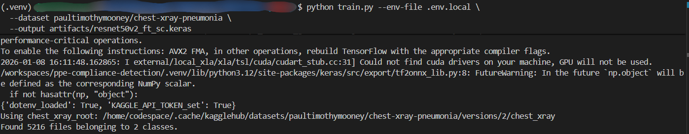
```bash
python scripts/eval_model.py --model notebooks/artifacts/resnet50v2_ft.keras
```
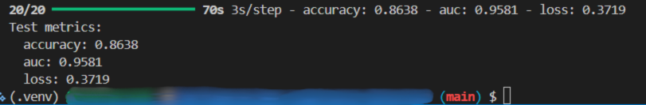

### Local service (FastAPI):

1. Start the web server on port 9696:

```bash
python -m uvicorn service.predict:app --host 0.0.0.0 --port 9696
```

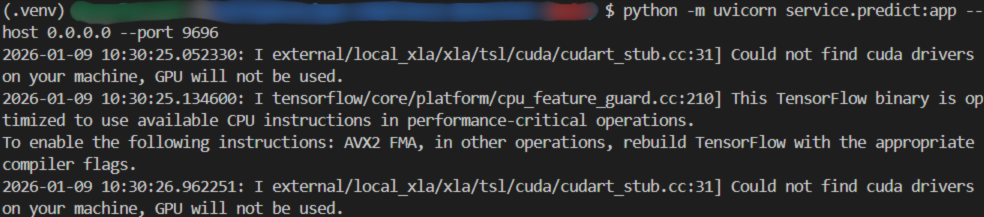

2. Test `/predict` on image samples:

```bash
curl -X POST -F "file=@data/normal.jpeg" http://127.0.0.1:9696/predict
curl -X POST -F "file=@data/pneumonia.jpeg" http://127.0.0.1:9696/predict
```

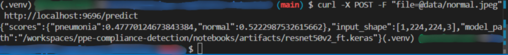

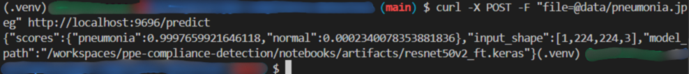

### Docker (local container):

1. Run the docker image locally: 

```bash
docker run -it --rm -p 9696:9696 chest-xray-pneumonia
```

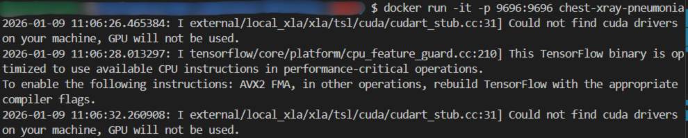

2. Test `/predict` against the running container (send requests to the containerized service):

```bash
curl -X POST -F "file=@data/pneumonia.jpeg" http://localhost:9696/predict
```

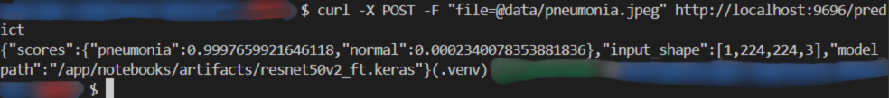

### Deploy to Kubernetes (Kind):

**1. Create Kind cluster:**
- Here using the default configuration:

```bash
kind create cluster
kind load docker-image chest-xray-pneumonia:latest --name mlzoomcamp
```
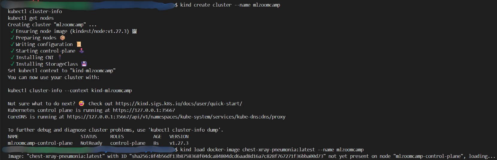

**2. Deploy the service:**

```bash
kubectl apply -f k8s/deployment.yaml
kubectl apply -f k8s/service.yaml
kubectl rollout status deploy/chest-xray-pneumonia
```
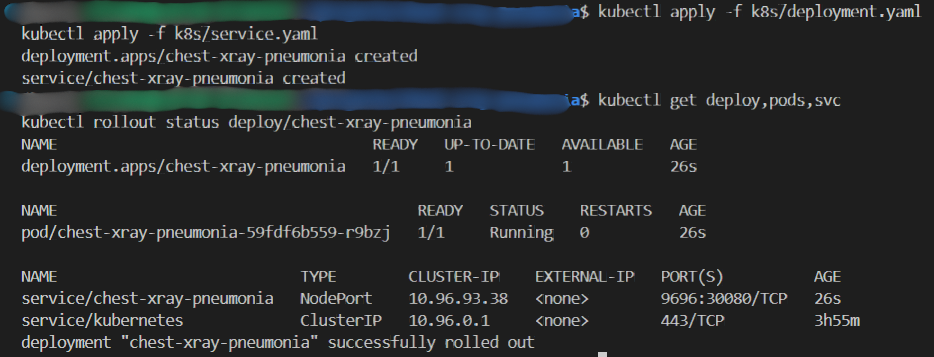

**3. Test NodePort service:**

```bash
curl http://127.0.0.1:30080/health
curl -X POST -F "file=@data/normal.jpeg" http://127.0.0.1:30080/predict
```
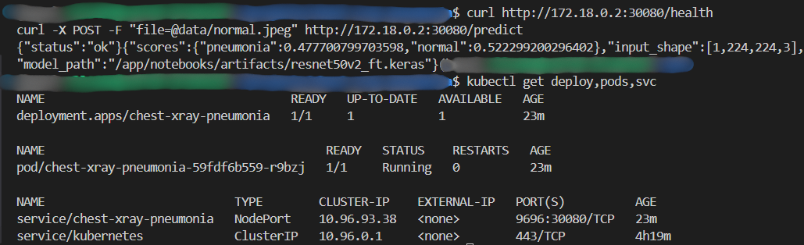

**4. Test NodePort service with `kind-config.yaml`:**
- Run the entire procedure using the `kind-config.yaml` file to configure the cluster:

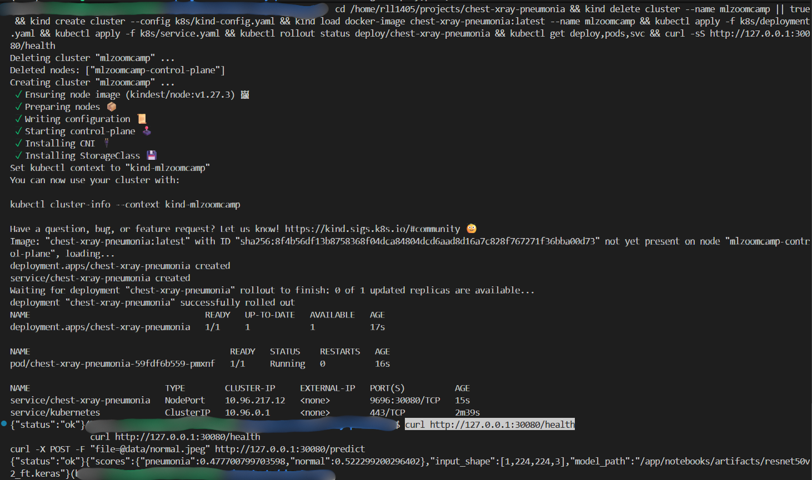